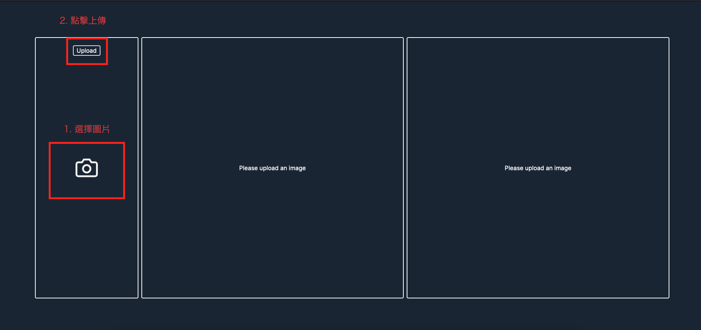
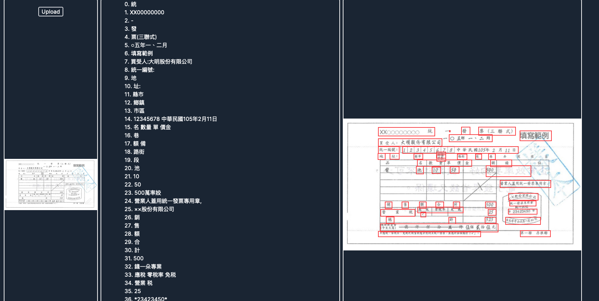

# 簡介
此專案是使用Google Vision API 實作的簡單文字辨識的prototype

> 起始畫面


> 結果


# 安裝步驟
1. 安裝到本地端
```
git clone https://github.com/TinyMurky/nextjs_ocr.git
```

2. cd 進入資料夾
```
cd nextjs_ocr
```

3. 安裝必要工具
```
npm i
```

4. 修改 .env.local：
將 `./.env.local.example`改名成為`.env.local`，並輸入以下資料
- `GOOGLE_PROJECT_ID`: 輸入GCP project資料
- `GOOGLE_CREDENTIALS_BASE64`: google service account 金鑰json檔經過Base 64轉換版本

可以用下面指令切換
```
base64 -i 金鑰.json -o 轉出base64存放位置
```

> 以上資料也可以直接找Murky要

5. 啟動專案
```
npm run dev
```

或是
```
npm run build
npm run start
```

6. 進入網頁使用
打開網頁輸入：
```
localhost:3000
```

點擊畫面左側的 **相機** 可以上傳圖片，upload之後會檢視文字

# Google Vision Api Return
Google vision回傳的資料可以在 [`./return.json`](./return.json) 中看到